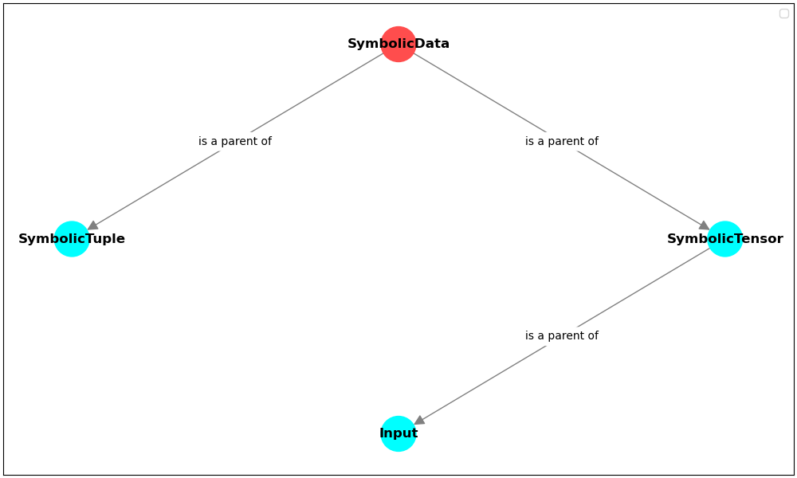

# symbolic_data

This is a collection of symbolic data types. 

The main class and grandfather for all other classes is `SymbolicData`. 

Inheritance tree:



``SymbolicTensor`` and ``Input`` are similar to ``torch.Tensor`` object,
but they are used only to define the graph, not to perform actual computations. 
You should use them to register new layers in your computation graph and later to create the model.
They have some common methods implemented, e.g. `tensor.t()` or `tensor.T` for transposition.

``SymbolicData`` supports slicing too, so you can do:
```python
from pytorch_symbolic import Input, SymbolicModel

x = Input(batch_shape=(3, 4, 5))

y = x[0]
for row in x[1:]:
	y += row
	
model = SymbolicModel(x, y)
```

But be careful! Each slice operation creates a new layer,
so if you do a lot of slicing, 
it is better enclose it in a custom module.
However, being able to do it directly on ``SymbolicData`` is great for prototyping.


::: pytorch_symbolic.Input
    options:
        show_source: false
        heading_level: 2
        show_root_heading: true
        members_order: source
        show_object_full_path: false
        docstring_section_style: table
        show_signature_annotations: true
        separate_signature: true
        annotations_path: brief
        merge_init_into_class: true
        show_root_full_path: true

::: pytorch_symbolic.symbolic_data.SymbolicData
    options:
        show_source: false
        heading_level: 2
        show_root_heading: true
        members_order: source
        show_object_full_path: false
        docstring_section_style: table
        show_signature_annotations: true
        separate_signature: true
        annotations_path: brief
        merge_init_into_class: true
        show_root_full_path: true

::: pytorch_symbolic.symbolic_data.SymbolicTensor
    options:
        show_source: false
        heading_level: 2
        show_root_heading: true
        members_order: source
        show_object_full_path: false
        docstring_section_style: table
        show_signature_annotations: true
        separate_signature: true
        annotations_path: brief
        merge_init_into_class: true
        show_root_full_path: true

::: pytorch_symbolic.symbolic_data.SymbolicTuple
    options:
        show_source: false
        heading_level: 2
        show_root_heading: true
        members_order: source
        show_object_full_path: false
        docstring_section_style: table
        show_signature_annotations: true
        separate_signature: true
        annotations_path: brief
        merge_init_into_class: true
        show_root_full_path: true
