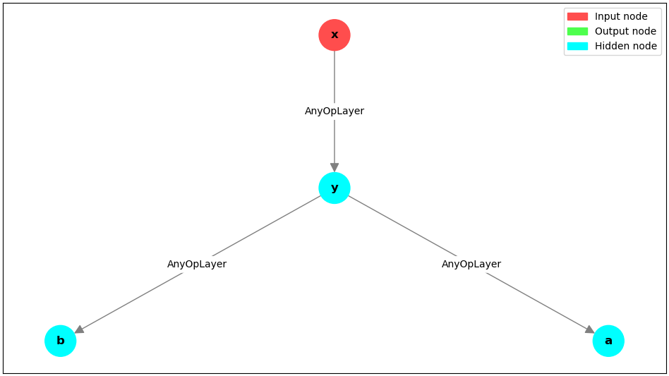
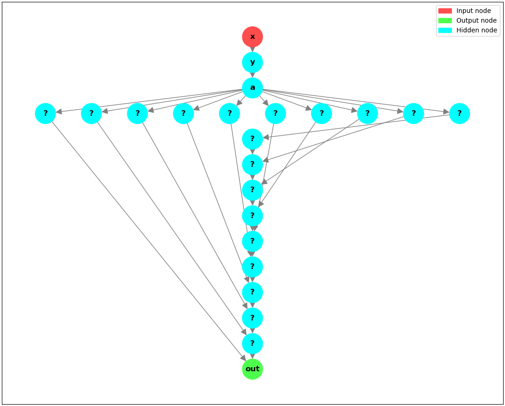
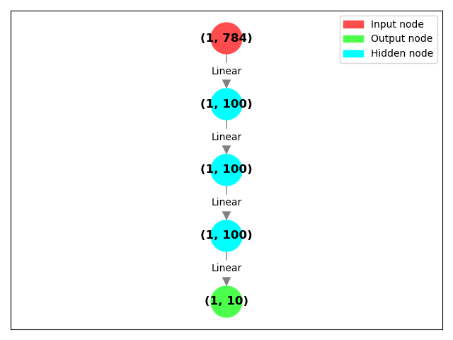
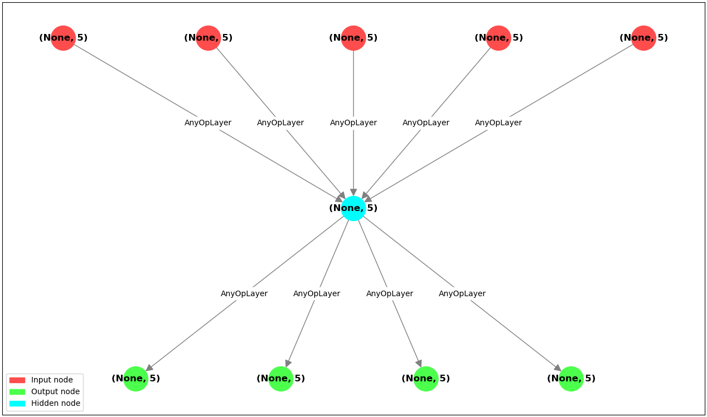
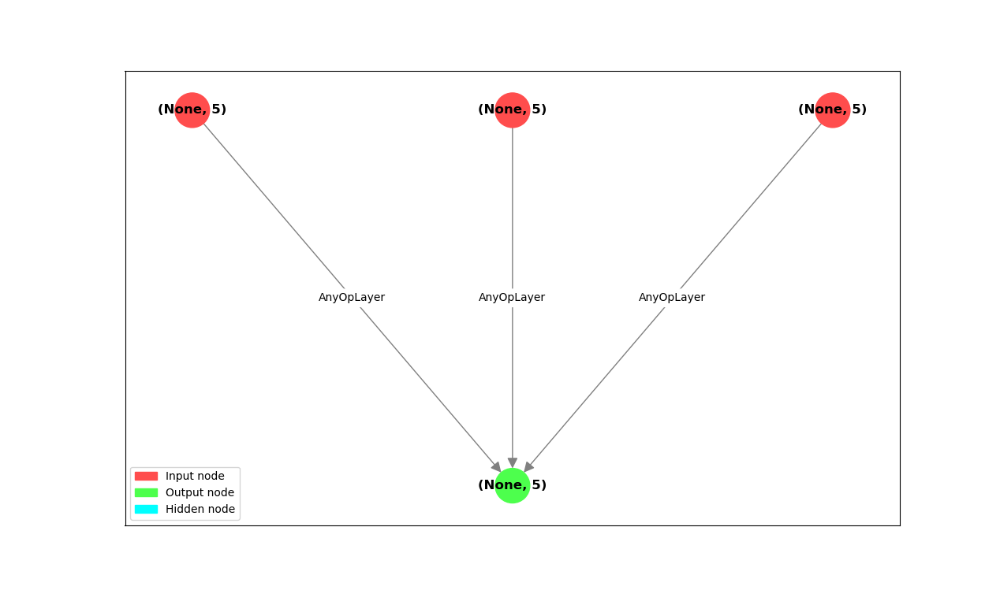
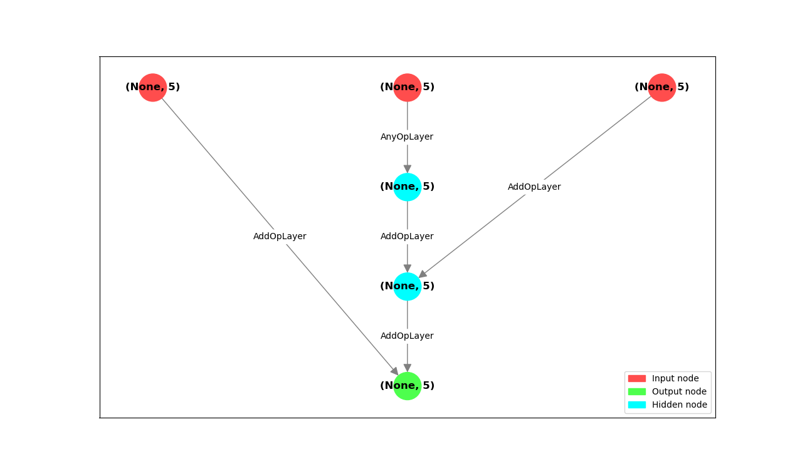
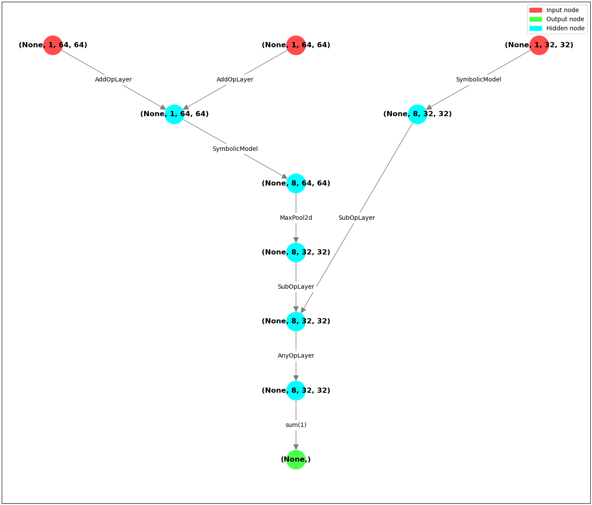

# Advanced Topics

## Underlying graphs

Deep neural networks can be represented as directed acyclic graphs (DAGs) where:

* nodes are inputs, outputs or intermediate states
* edges are layers (in general transformations or functions)

In such graph,
there exists a nonempty set of input nodes and a nonempty set of output nodes.
If your architecture meets the above conditions, it can be created in a symbolic manner.

Every time you execute `Input`, you create a node in this graph.

```python
from pytorch_symbolic import Input

x = Input(shape=(1,))
print(x)
```

```stdout
<SymbolicTensor at 0x7f55dc437bb0; 0 parents; 0 children>
```

`Input` is a function for creating Symbolic Data.
Symbolic Tensor is a special case of Symbolic Data.
The difference between them is the underlying object.
Basically, Symbolic Data can have any Python object underneath
and Symbolic Tensor always has `torch.Tensor` underneath.
You should use Symbolic Tensor whenever possible as the library is tested with it in mind.
But if needed, you can define whole graphs of operations with other underlying datatypes.

Three rules that should hold true:

1. `SymbolicData` returned from `Input` has no parents
2. every other `SymbolicData` has at least one parent
3. every other `SymbolicData` is a result of an operation on `SymbolicData`

The provided public API will not let you break these,
but if you are really determined, you can break them by modifying private variables.
This can lead to directed cycles in your graph. If this happens, you probably won't be able to
create the model from your graph, instead you'll be attacked with an assertion error.

One exception is when your graph has directed cycles,
but you create the model from a subgraph
(all nodes between `inputs` and `outputs` induce the subgraph)
that doesn't contain any directed cycle. Then you'll be fine and the model will be created.

In general, when you transform any Symbolic Data, a new Symbolic Data is created.

```py
y = x + 2
print(y)
```

```stdout
<SymbolicTensor at 0x7f55dc437eb0; 1 parents; 0 children>
```

This _transformation_ is always just an `torch.nn.Module`.
Even when you use `+` or `-` operators, there's an `torch.nn.Module` created underneath.
In case of `+` and `-` it's a module that adds or subtracts two inputs.
These operators are defined using `useful_layers.LambdaOpLayer`.

```py
print(y.layer)
```

```stdout
LambdaOpLayer()
```

When you add new nodes to the graph as a result of some operation,
they will be registered as children of other nodes,
You can check children or parents of a node by accessing:

* `node.parents: Tuple[SymbolicData, ...]`
* `node.children: Tuple[SymbolicData, ...]`

It's forbidden to modify parents after Symbolic Data is created,
but new children can always be added by applying new operations.
Every operation on Symbolic Data creates at least one new child.
If your `torch.nn.Module` has more than one output, more children will be created.
Usually modules have just one output:

```py
print(y)
a = y - 1
print(y)
b = y / 2
print(y)
```

```stdout
<SymbolicTensor at 0x7f55dc437100; 1 parents; 0 children>
<SymbolicTensor at 0x7f55dc437100; 1 parents; 1 children>
<SymbolicTensor at 0x7f55dc437100; 1 parents; 2 children>
```

We created a bunch of children for `y`. Let's see them:

```py
print(y.children)
```

```stdout
(<SymbolicTensor at 0x7f55dc639280; 1 parents; 0 children>, 
 <SymbolicTensor at 0x7f55dc64cbe0; 1 parents; 0 children>)
```

But when working with large graphs, it might not be fun to inspect
them by printing children and parents to stdout. Luckily, there is a nicer alternative:
Pytorch Symbolic provides a basic graph drawing utility.
It will work only if you have optional dependencies installed:

```
networkx
matplotlib
scipy
```

You can install them manually or using `pip install pytorch-symbolic[full]`.

> If you don't have optional dependencies, you can use the package without drawing utility.

Let us draw our graph:

```py
from pytorch_symbolic import graph_algorithms

graph_algorithms.draw_graph(inputs=x, node_text_namespace=globals())
```



We use `node_text_namespace=globals()` so that Pytorch Symbolic attempts
to display variable names on nodes.
This is useful for understanding what is going on in the graph.
It can be more difficult to use when graph was defined in a local namespace.
Alternatively, you can use argument `node_text_func` to define your
own custom labels on nodes.
This argument is a `Callable` that takes Symbolic Data as input and returns `str` as output.
By default, it displays underlying tensor shape.

> **Tip:** consider using `try: ... except: ...` in your `node_text_func`.
> There are many data types a node can have underneath, so the chances are you
> get an `AttributeError` otherwise.

Be careful! Drawing utility is designed to display simple graphs
so it might not work well for large neural networks.
You can tune the figure size and other stuff using `matplotlib` library:

```py
import matplotlib.pyplot as plt

nodes = [a + i for i in range(10)]
out = sum(nodes)

plt.figure(dpi=300)

graph_algorithms.draw_graph(
    inputs=x,
    outputs=out,
    edge_text_func=lambda x: "",
    node_text_namespace=globals(),
    figsize=(10, 10),
)
```



Question mark displayed instead the name of a variable indicates that the variable
was not found in the given namespace.
Similarly to `node_text_func` you can use `edge_text_func` to display custom labels on the edges.
By default, we display the name of the layer, e.g. `Linear` or `Conv2d`.

## Creating models

After creating Symbolic Data and defining the operations,
you want to enclose them in a model.
It might be a neural network or just an arbitrary graph of computations.
After creating Symbolic Model you will be able to use it with your own data.

```python
from torch import nn
from pytorch_symbolic import Input, SymbolicModel

inputs = x = Input((784,))

for _ in range(3):
    x = nn.Linear(x.features, 100)(x)

x = nn.Linear(x.features, 10)(x)
model = SymbolicModel(inputs, x)
model.summary()  # Keras-like summary
```

```stdout
_________________________________________________
     Layer      Output shape   Params   Parent   
=================================================
1    Input_1    (None, 784)    0                 
2    Linear_1   (None, 100)    78500    1        
3    Linear_2   (None, 100)    10100    2        
4    Linear_3   (None, 100)    10100    3        
5*   Linear_4   (None, 10)     1010     4        
=================================================
Total params: 99710
Trainable params: 99710
Non-trainable params: 0
_________________________________________________
```

You can use the plotting utility directly on your model:

```py
from pytorch_symbolic import graph_algorithms

graph_algorithms.draw_graph(model=model)
```



As you can see, if the batch size is not specified, Pytorch Symbolic uses batch size of 1.

## Multiple inputs and outputs

If your `torch.nn.Module` has multiple inputs or outputs, that's fine:

```python
from torch import nn
from pytorch_symbolic import Input, SymbolicModel, useful_layers, graph_algorithms


class AddN(nn.Module):
    def forward(self, *tensors):
        return sum(tensors)


inputs = [Input((5,)) for _ in range(5)]
intermediate = AddN()(*inputs)
outputs = [intermediate / i for i in range(1, 5)]

model = SymbolicModel(inputs, outputs)
model.summary()
graph_algorithms.draw_graph(model=model, figsize=(9, 6))
```

```stdout
____________________________________________________________
      Layer             Output shape   Params   Parent      
============================================================
1     Input_1           (None, 5)      0                    
2     Input_2           (None, 5)      0                    
3     Input_3           (None, 5)      0                    
4     Input_4           (None, 5)      0                    
5     Input_5           (None, 5)      0                    
6     LambdaOpLayer_1   (None, 5)      0        1,2,3,4,5   
7*    LambdaOpLayer_2   (None, 5)      0        6           
8*    LambdaOpLayer_3   (None, 5)      0        6           
9*    LambdaOpLayer_4   (None, 5)      0        6           
10*   LambdaOpLayer_5   (None, 5)      0        6           
============================================================
Total params: 0
Trainable params: 0
Non-trainable params: 0
____________________________________________________________
```



Notice that we used custom `AddN` module instead of just `intermediate = sum(inputs)`.
Both versions would be correct.
In fact, they produce equivalent models, but their underlying graphs are different.

Let us compare two smaller examples:

```py
inputs = [Input((5,)) for _ in range(3)]
graph_algorithms.draw_graph(inputs=inputs, outputs=AddN()(*inputs))
```



And:

```
graph_algorithms.draw_graph(inputs=inputs, outputs=sum(inputs))
```



This difference exists because `sum` is executing multiple `__add__` operations under the hood.

## Reusing existing layers

Each node, except those created by `Input`, is associated with some `torch.nn.Module`.
When you are reusing a part of the graph, you are reusing all underlying
`torch.nn.Module` too.
Thanks to this, you can have multiple models sharing the same weights.
Or one model using the same weights multiple times.

For example, imagine you created a model that classifies RGB images:

```python
from torch import nn
from pytorch_symbolic import Input, SymbolicModel

inputs = x = Input((1, 28, 28))

for _ in range(3):
    x = nn.Conv2d(x.C, 8, 3, padding=1)(x)(nn.ReLU())

features = x

x = nn.Flatten()(x)
outputs = nn.Linear(x.features, 10)(x)

classifier = SymbolicModel(inputs, outputs)
classifier.summary()
```

```stdout
_______________________________________________________
     Layer       Output shape        Params   Parent   
=======================================================
1    Input_1     (None, 1, 28, 28)   0                 
2    Conv2d_1    (None, 8, 28, 28)   80       1        
3    ReLU_1      (None, 8, 28, 28)   0        2        
4    Conv2d_2    (None, 8, 28, 28)   584      3        
5    ReLU_2      (None, 8, 28, 28)   0        4        
6    Conv2d_3    (None, 8, 28, 28)   584      5        
7    ReLU_3      (None, 8, 28, 28)   0        6        
8    Flatten_1   (None, 6272)        0        7        
9*   Linear_1    (None, 10)          62730    8        
=======================================================
Total params: 63978
Trainable params: 63978
Non-trainable params: 0
_______________________________________________________
```

After training `classifier`, you might decide that you want to inspect the intermediate features.

```py
feature_extractor = SymbolicModel(inputs, features)
feature_extractor.summary()
```

```stdout
______________________________________________________
     Layer      Output shape        Params   Parent   
======================================================
1    Input_1    (None, 1, 28, 28)   0                 
2    Conv2d_1   (None, 8, 28, 28)   80       1        
3    ReLU_1     (None, 8, 28, 28)   0        2        
4    Conv2d_2   (None, 8, 28, 28)   584      3        
5    ReLU_2     (None, 8, 28, 28)   0        4        
6    Conv2d_3   (None, 8, 28, 28)   584      5        
7*   ReLU_3     (None, 8, 28, 28)   0        6        
======================================================
Total params: 1248
Trainable params: 1248
Non-trainable params: 0
______________________________________________________
```

This model, `feature_extractor`, uses the same underlying weights
as already trained `classifier`,
but it outputs the intermediate features you wanted to inspect.
It does so without modifying the original model!

There's also another way of achieving the end result, this one modifies the original model:

```py
classifier.add_output(features)
classifier.summary()
```

```stdout
_______________________________________________________
     Layer       Output shape        Params   Parent   
=======================================================
1    Input_1     (None, 1, 28, 28)   0                 
2    Conv2d_1    (None, 8, 28, 28)   80       1        
3    ReLU_1      (None, 8, 28, 28)   0        2        
4    Conv2d_2    (None, 8, 28, 28)   584      3        
5    ReLU_2      (None, 8, 28, 28)   0        4        
6    Conv2d_3    (None, 8, 28, 28)   584      5        
7*   ReLU_3      (None, 8, 28, 28)   0        6        
8    Flatten_1   (None, 6272)        0        7        
9*   Linear_1    (None, 10)          62730    8        
=======================================================
Total params: 63978
Trainable params: 63978
Non-trainable params: 0
_______________________________________________________
```

Now there's a dot next to the 7th and 9th layers indicating both 7th and 9th layers' outputs
are returned from the model. Previously only 9th layer's output was returned.

## Nested models

Instance of Symbolic Model is just a `torch.nn.Module` and you can use it as such.
This means you can use it anywhere, including another Symbolic Model or vanilla model.
Create new models, using the existing ones.
Here we create a model that calculates how similar are two feature maps generated
by previously defined `feature_extractor`:

```py
import torch
from pytorch_symbolic import add_to_graph, graph_algorithms

inputs1 = Input((1, 32, 32))
inputs2 = Input((1, 64, 64))

noise = Input((1, 64, 64))

features1 = feature_extractor(inputs1)
features2 = feature_extractor(inputs2 + noise)
features2 = nn.MaxPool2d(2)(features2)

diffs = (features1 - features2) ** 2

outputs = add_to_graph(torch.sum, diffs, dim=(1, 2, 3))
strange_model = SymbolicModel((inputs1, inputs2, noise), outputs)
strange_model.summary()
```

```stdout
______________________________________________________________
      Layer             Output shape        Params   Parent   
==============================================================
1     Input_1           (None, 1, 32, 32)   0                 
2     Input_2           (None, 1, 64, 64)   0                 
3     Input_3           (None, 1, 64, 64)   0                 
4     SymbolicModel_1   (None, 8, 32, 32)   1248     1        
5     AddOpLayer_1      (None, 1, 64, 64)   0        2,3      
6     SymbolicModel_2   (None, 8, 64, 64)   1248     5        
7     MaxPool2d_1       (None, 8, 32, 32)   0        6        
8     SubOpLayer_1      (None, 8, 32, 32)   0        4,7      
9     LambdaOpLayer_1   (None, 8, 32, 32)   0        8        
10*   wrap(sum)_1       (None,)             0        9        
==============================================================
Total params: 1248
Trainable params: 1248
Non-trainable params: 0
______________________________________________________________
```

```py
graph_algorithms.draw_graph(model=strange_model, figsize=(10, 8))
```



## Recreate Toy ResNet

We took an example of toy ResNet from
[tensorflow guide](https://www.tensorflow.org/guide/keras/symbolic) and
recreated it in a few different ways. Note that their code for model definition
is **16 lines of code long**, excluding imports and utilities.

> In [benchmarks](benchmarks.md) you can see toy ResNet benchmarked!

Using Pytorch Symbolic, you can create toy ResNet using exactly as many lines as using Keras:

```python
from torch import nn
from pytorch_symbolic import Input, SymbolicModel

inputs = Input(shape=(3, 32, 32))
x = nn.Conv2d(inputs.C, 32, 3)(inputs)(nn.ReLU())
x = nn.Conv2d(x.C, 64, 3)(x)(nn.ReLU())
block_1_output = nn.MaxPool2d(3)(x)

x = nn.Conv2d(block_1_output.C, 64, 3, padding=1)(block_1_output)(nn.ReLU())
x = nn.Conv2d(x.C, 64, 3, padding=1)(x)(nn.ReLU())
block_2_output = x + block_1_output

x = nn.Conv2d(block_2_output.C, 64, 3, padding=1)(block_2_output)(nn.ReLU())
x = nn.Conv2d(x.C, 64, 3, padding=1)(x)(nn.ReLU())
block_3_output = x + block_2_output

x = nn.Conv2d(x.C, 64, 3)(block_3_output)(nn.ReLU())
x = nn.AvgPool2d(kernel_size=x.HW)(x)(nn.Flatten())
x = nn.Linear(x.features, 256)(x)(nn.ReLU())
x = nn.Dropout(0.5)(x)
outputs = nn.Linear(x.features, 10)(x)

model = SymbolicModel(inputs, outputs)
```

In fact, every line of code in Pytorch Symbolic and Keras is functionally equivalent.

For example this line in Keras:

```python
... = layers.Conv2D(64, 3, activation="relu", padding="same")(x)
```

is equivalent to this line in Pytorch Symbolic:

```python
... = nn.Conv2d(x.C, 64, 3, padding=1)(x)(nn.ReLU())
```

Let's analyze what happens in the above lines:

* `torch.nn.Conv2d` is PyTorch equivalent of Keras `keras.layers.Conv2d` layer
* Input channels:
	* In Keras we don't pass them openly - they'll be calculated automatically from the inputs
	* In Pytorch Symbolic we also calculate them automatically using `x.C`, but we pass them explicitly as an argument
* In both frameworks `64, 3` are the number of output channels and the size of the kernel
* Padding:
	* We use `padding="same"` in Keras
	* We use `padding=1` in PyTorch (for kernel size 3)
* Activation:
	* In Keras we simply add an argument `activation='relu'`
	* in Pytorch Symbolic we add `torch.nn.ReLU()` as a transformation that happens
	  after `torch.nn.Conv2d(...)`

The example below is equivalent, but uses the other way of registering layers in the network:

```python
from torch import nn
from pytorch_symbolic import Input, SymbolicModel

inputs = Input(shape=(3, 32, 32))
x = inputs(nn.Conv2d(inputs.channels, 32, 3))(nn.ReLU())
x = x(nn.Conv2d(x.channels, 64, 3))(nn.ReLU())
block_1_output = x(nn.MaxPool2d(3))

x = block_1_output(nn.Conv2d(block_1_output.channels, 64, 3, padding=1))(nn.ReLU())
x = x(nn.Conv2d(x.channels, 64, 3, padding=1))(nn.ReLU())
block_2_output = x + block_1_output

x = block_2_output(nn.Conv2d(block_2_output.channels, 64, 3, padding=1))(nn.ReLU())
x = x(nn.Conv2d(x.channels, 64, 3, padding=1))(nn.ReLU())
block_3_output = x + block_2_output

x = block_3_output(nn.Conv2d(x.channels, 64, 3))(nn.ReLU())
x = x(nn.AvgPool2d(kernel_size=(x.H, x.W)))(nn.Flatten())
x = x(nn.Linear(x.features, 256))(nn.ReLU())
x = x(nn.Dropout(0.5))
outputs = x(nn.Linear(x.features, 10))

model = SymbolicModel(inputs, outputs)
```

This took 16 lines of code as well.

You can register new layers in whichever way you prefer, you can mix them too.

### Vanilla PyTorch

A usual way to define a model in PyTorch is to create a class that inherits from `torch.nn.Module`.

PyTorch non-symbolic example of toy ResNet from the previous section:

```python
from torch import nn


class ToyResNet(nn.Module):
    def __init__(self):
        super().__init__()
        self.relu = nn.ReLU()
        self.block1conv1 = nn.Conv2d(3, 32, 3)
        self.block1conv2 = nn.Conv2d(32, 64, 3)
        self.maxpool = nn.MaxPool2d(3)

        self.block2conv1 = nn.Conv2d(64, 64, 3, padding=1)
        self.block2conv2 = nn.Conv2d(64, 64, 3, padding=1)

        self.block3conv1 = nn.Conv2d(64, 64, 3, padding=1)
        self.block3conv2 = nn.Conv2d(64, 64, 3, padding=1)

        self.conv1 = nn.Conv2d(64, 64, 3)

        kernel_size = 7  # calculated by hand
        self.global_pool = nn.AvgPool2d(kernel_size)
        self.flatten = nn.Flatten()
        self.linear = nn.Linear(64, 256)
        self.dropout = nn.Dropout(0.5)
        self.classifier = nn.Linear(256, 10)

    def forward(self, x):
        x = self.relu(self.block1conv1(x))
        x = self.relu(self.block1conv2(x))
        block_1_output = self.maxpool(x)

        x = self.relu(self.block2conv1(block_1_output))
        x = self.relu(self.block2conv2(x))
        block_2_output = x + block_1_output

        x = self.relu(self.block3conv1(block_2_output))
        x = self.relu(self.block3conv2(x))
        block_3_output = x + block_2_output

        x = self.relu(self.conv1(block_3_output))
        x = self.global_pool(x)
        x = self.flatten(x)
        x = self.relu(self.linear(x))
        x = self.dropout(x)
        return self.classifier(x)


model = ToyResNet()
```

This took over 30 lines of code.

## Advanced custom functions

If you read [Quick Start](quick_start.md), you know that the best way to include a custom
function in your model is to use it inside a `torch.nn.Module`.
Just put the function call in `forward` method. If your function needs additional arguments,
for example for the dimension, you can specify them in `__init__`, like this:

```python
import torch
from torch import nn


class ConcatLayer(nn.Module):
    def __init__(self, dim):
        super().__init__()
        self.dim = dim

    def forward(self, *tensors):
        return torch.cat(tensors=tensors, dim=self.dim)
```

This way provides a robust and fast runtime. However, you might not want to write
so much boilerplate code. Luckily, with Pytorch Symbolic there is a way to avoid it:

```py
from pytorch_symbolic import Input, add_to_graph

x = Input(batch_shape=(2, 10, 20))
y = Input(batch_shape=(2, 20, 20))
concatenated = add_to_graph(torch.cat, (x, y), dim=1)
```

Function `add_to_graph` is powerful, but use it responsibly.
It adds some CPU overhead, because it is parsing arguments in search of Symbolic Data.
This won't matter in GPU heavy workloads,
but might contribute to a slowdown in CPU limited scenarios.

Here is an overcomplicated example 
to give you an idea of what `add_to_graph` allows you to do:

```python
import torch
from pytorch_symbolic import Input, SymbolicModel, add_to_graph

x = Input(batch_shape=(10, 20))
y = Input(batch_shape=(20, 30))
z = Input(batch_shape=(30, 10))

data_dict = {
    "tensors": {
        "constant": torch.rand(10, 10),
        "symbolic": x,
        "parameters": [y, z]
    },
    "metadata": {
        "date": "01.01.2001",
        "name": "Batman",
    }
}


def execute_noisy(data_dict, *, add_noise: bool = False):
    params = data_dict["tensors"]["parameters"]
    x = data_dict["tensors"]["symbolic"]

    for param in params:
        x = x @ param

    if add_noise:
        print("Adding noise!")
        x = x + data_dict["tensors"]["constant"]
    return x, data_dict["tensors"]["constant"]


outputs, noise = add_to_graph(execute_noisy, data_dict, add_noise=True)
model = SymbolicModel(inputs=(x, y, z), outputs=outputs)
model.summary()
```

```stdout
Adding noise!
______________________________________________________________
     Layer                   Output shape   Params   Parent   
==============================================================
1    Input_1                 (10, 20)       0                 
2    Input_2                 (20, 30)       0                 
3    Input_3                 (30, 10)       0                 
4    wrap(execute_noisy)_1   tuple          0        1,2,3    
5*   UnpackLayer_1           (10, 10)       0        4        
==============================================================
Total params: 0
Trainable params: 0
Non-trainable params: 0
______________________________________________________________
```

Your function will be called by `add_to_graph` during tracing
and will be registered in the graph as a `torch.nn.Module` that wraps it.
This operation produces a Symbolic Data which you can use to define more operations
or to create a Symbolic Model.

This model will execute your custom function during the runtime! Use it as always:

```py
x = torch.rand((10, 20))
y = torch.rand((20, 30))
z = torch.rand((30, 10))

outs = model(x, y, z)
```

```stdout
Adding noise!
```

Everything that is _not_ a Symbolic Data in `add_to_graph` is considered
constant and will stay the same each time you execute the model.
In our example `add_noise` stayed `True` even after creating the model.
Under the hood, Pytorch Symbolic is browsing through
the arguments in search of Symbolic Data.
Only they will be replaced by new, real data during the execution.
Argument parser is able to navigate through nested `list`, `tuple` and `dict`.

## Arbitrary Symbolic Data

So we've been saying Symbolic Data over and over,
but we always used Symbolic Tensor underneath, which makes it
a special case of Symbolic Data.
But the fact is, Symbolic Data can have an arbitrary Python object underneath.

```python
from pytorch_symbolic import CustomInput, SymbolicModel
import numpy as np

input1 = x = CustomInput(np.random.rand(100, 200))
input2 = y = CustomInput(np.array([1, 2, 3]))

z = x[:, :, None] + y.reshape(1, 1, -1)
model = SymbolicModel((input1, input2), outputs=z)
model.summary()

```

```stdout
______________________________________________________________________
     Layer             Output shape                 Params   Parent   
======================================================================
1    Input_1           ndarray                      0                 
2    Input_2           ndarray                      0                 
3    SliceLayer_1      ndarray                      0        1        
4    GetAttr_1         method-wrapper               0        3        
5    GetAttr_2         builtin_function_or_method   0        2        
6    wrap(reshape)_1   ndarray                      0        5        
7*   wrap(__add__)_1   ndarray                      0        4,6      
======================================================================
Total params: 0
Trainable params: 0
Non-trainable params: 0
______________________________________________________________________
```

Use it as always, but take care to have inputs compatible with the operations you defined.

```py
example_outs = model(np.random.rand(100, 200), np.random.rand(3))
example_outs.shape
```

```stdout
(100, 200, 3)
```

The model above defines a graph of operations on underlying `numpy` arrays.

You can create replayable graphs of your favorite Python operations.
Pytorch Symbolic is a generic framework for enclosing arbitrary Python operations
in a `torch.nn.Module` and replaying them.

But note a few things:

* You can use most of the methods defined for your data type,
  e.g. `symbolic_numpy.reshape(...)` will return another Symbolic Data with
  underlying `ndarray` which you can use to define more operations or create a Symbolic Model.
* Pytorch Symbolic won't play nicely with in-place operations.
  For example, when working with Symbolic Data with underlying lists it is better
  to use `new = symbolic_list + [5]` instead of `symbolic_list.append(5)`.
  If you use in-place operation, it will _not_ be replayed during graph re-execution,
  unless its output (usually `None`) is included in Symbolic Model's outputs.
  It is your responsibility to avoid in-place operations.
