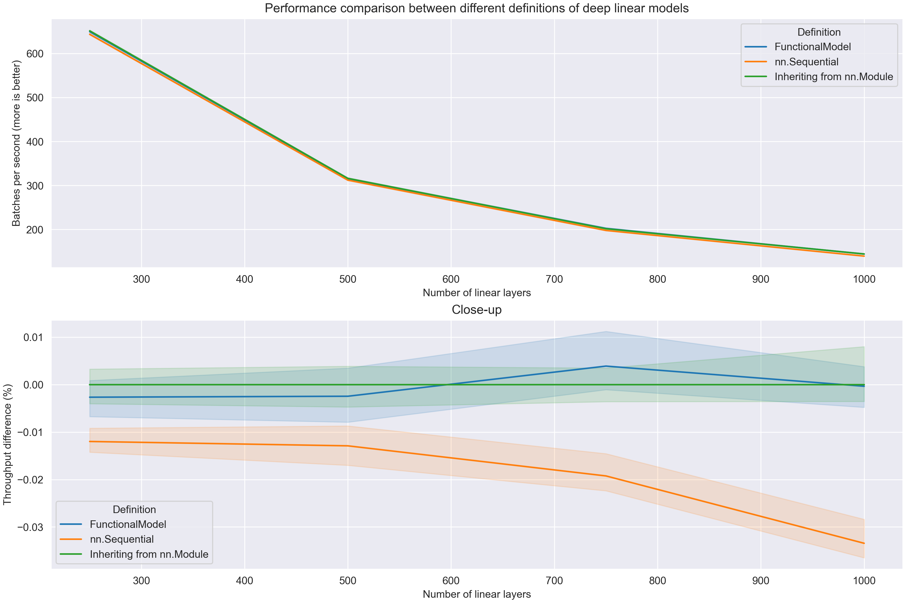
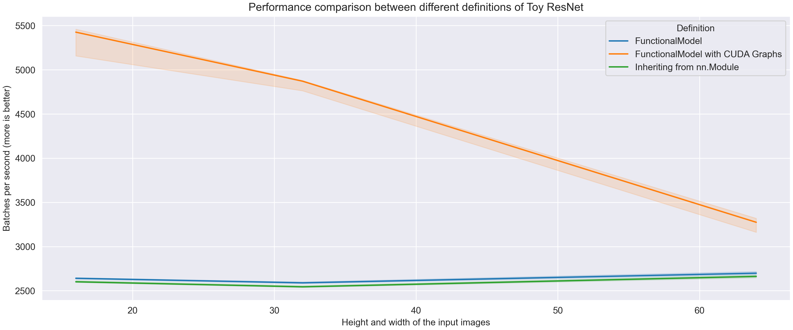

# Benchmarks

Functional API simplifies and speeds up prototyping
and developement process.
But does it sacrifice performance of the model itself?

One of the most important principles in building this library was to
avoid this.
It was made with performance in mind.

Standard model definition: a class inheriting form `nn.Module`
is a baseline for us.
Functional API aims to create models just as fast in all scenarios.

## Tweaks

When using FunctionalModel for performance critical use case, you should use `optimize_module_calls` after all models are created.

```python
from torch import nn
from pytorch_functional import Input, FunctionalModel, optimize_module_calls

x = inputs = Input(shape=(3, 32, 32))
x = nn.Identity()(x)
model = FunctionalModel(inputs, x)

optimize_module_calls()
```

Not using it might give you a little slowdown. We use it in the benchmarks.

## Deep linear model

Pytorch Functional cannot change the kernel runtime.
The only place where it _might_ introduce a slowdown, is before the kernel launches.
To see if it does, we will maximize the number of kernel calls.

We will look at a very thin and deep model with linear layers only.
Each layer will have only 4 features.
If there's _any_ overhead induced by FunctionalModel, it should be visible here.
In larger models, the overhead could be hidden by the kernel computation.

#### Data

Data is randomly generated.

```py
import torch

data = torch.rand(size=(4, 4))
```

#### Model definition

```py
from torch import nn
from pytorch_functional import Input, FunctionalModel

n_layers = 250  # other used values: 500, 750, 1000

x = inputs = Input(shape=(4,))
for _ in range(n_layers):
    x = nn.Linear(4, 4)(x)
model = FunctionalModel(inputs, x)
```

### Inference (cpu)

For such small subsequent matrix multiplications,
it can be faster to launch the model on the CPU.


> Percentile intervals [25, 75] are visible. Sequential model seems to be
> slower from the others. This can be explained by additional operations
> introduced by the iterator in `nn.Sequential`.
> It is slowing down more, as the number of layers is increasing.
> The other two seem to be equal!

## Toy ResNet

This model is presented in [Quick Start](quick_start.md),
it was also used as an example in TensorFlow documentation.
It is a shallower and thiner version of normally used ResNet networks.

#### Data

Data is randomly generated.

```py
import torch

data = torch.rand(size=(4, 3, 16, 16))  # Resolution from 16x16 to 64x64
```

#### Model definition

Definition can be found in [Quick Start](quick_start.md).

### Inference (gpu)


> CUDA Graphs have a huge advantage here due to the small batch size and image size.
> For non CUDA Graphed models GPU is executing kernels much faster than CPU
> is scheduling the work.
> This is why we don't see any slowdown when the image resolution increases.
> FunctionalModel is slightly faster than the Vanilla model. 
> This is due to implementation details.
> For example, it is quite slow to access a layer by `__getattr__` (`self.layer`)
> in forward function.
> In FunctionalModel there is no need to do this.

## How is `FunctionalModel` optimized?

Functional models reside on underlying graph structures.
Each `SymbolicTensor` is a node and each layer is an edge that connects two nodes.
Initialy, the forward pass was implemented lazily:
by executing `forward` in a layer only when
its output was needed by a child node. 
But such back-and-forth between parents and children created an unecessary overhead.
To avoid this, we precompute the exact order in which the layers needs to be called,
using topological ordering of the underlying graph structure.

Even when we know the order of the layers, there's one more trick.
Accessing structures has significant overhead in Python, so we want to avoid this.
When the model is created we dynamically generate code for `forward` function.
Thanks to this, `FunctionalModel` executes exactly the same code it would if you
were to write it as a class.

You can even see the generated code yourself:

```python
...
print(model._generated_forward_source)
```

```
def _generated_forward(self,i00,i01):
    l = self._execution_order_layers
    h09 = i01
    for layer in l[0:10]:
        h09 = layer(h09)
    h19 = i00
    for layer in l[10:20]:
        h19 = layer(h19)
    h20 = l[20](h19,h09)
    h21 = l[21](h20)
    h22 = l[22](h21)
    h32 = h22
    for layer in l[23:33]:
        h32 = layer(h32)
    h42 = h22
    for layer in l[33:43]:
        h42 = layer(h42)
    o00 = l[43](h42,h32)
    return o00
```

## Cuda Graphs

Additionaly, with Pytorch Functional it's very simple to enable CUDA Graphs
when GPU runtime is available. CUDA Graphs are a novel feature in PyTorch that can greatly
increase the performance of some models by reducing GPU idle time
and removing the overhead caused by CPU making GPU calls.

To enable CUDA Graphs, use:

```python
...
model = FunctionalModel(inputs, outputs, enable_cuda_graphs=True)
```

When using CUDA Graphs, please remember to cast your inputs to GPU.
In general, when using CUDA Graphs, you might get some silent errors, for example when you forget to cast your data to GPU.
Always check if everything is working _without_ CUDA Graphs before enabling them.

## Hardware

Unless stated otherwise, experiments were run on a following PC:

```
CPU: i7-12700KF
GPU: RTX 3080 10GB
```
